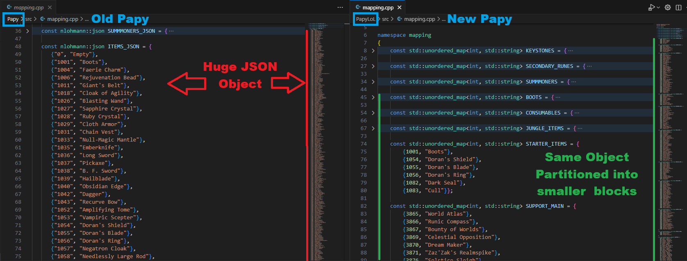
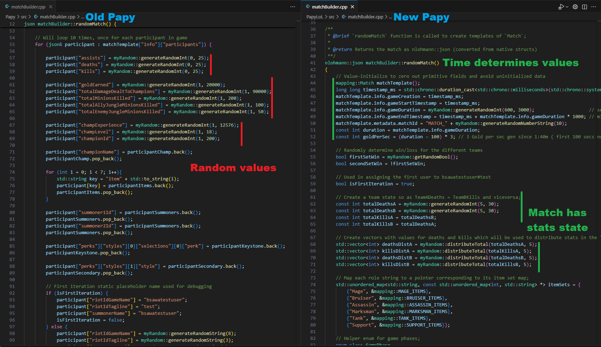
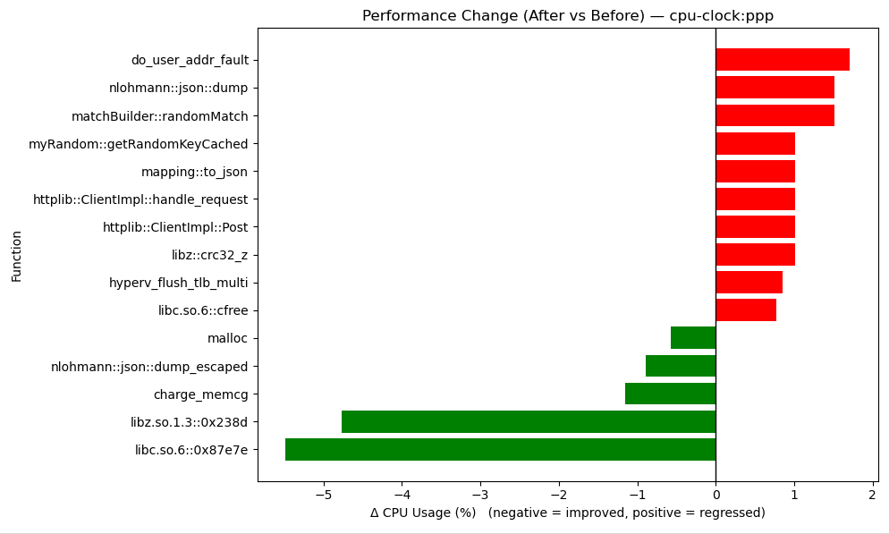

# **Comparisson between old Papy and PapyLoL**

When I first came upon this repo my first question was: Why ?

Not as someone experienced but as a beginner, I saw how the original creators threw away type safety ( necessary in C++ ) and speed of inherent C++ data structures ( or operations on them), 
for a "human readeable format". 

That made no sense to me because the code can be equally readeable with proper naming convention, function definition and data structuring.

So I wondered, what would be the speed difference if I converted this project the way I thought was correct, but before we get to the comparrison lets go through the changes:

- Changed the data type from JSON to maps and structs and broke the data into smaller blocks to easily itterate over, instead of itterating over one huge JSON object.


- Removed operations directly over JSON, now all data structures are C++ native.


- Afterwards I removed the random data assignment and added some "logical" deterministic outcomes based on the random data we receive.


Of course that now I ended up with a lot more code than there previously was, make use of more static memory as well, but finally we have reached the comparison.

## Individual tracking of performance:
```bash
perf record -F 99 -g -- ./bin/papy --threads 16 --endpoint "/printJson" --target "http://localhost" --payload lol --count 600
```

## Creating reports based on the `perf.data`:
```bash 
perf report --stdio > report_type.txt
```

## Compare reports:
```bash 
perf diff Before/perf.data ../perf.data > ../comparison.txt
```

## How to read:
In both the [Papy Report](./PerformanceComparisson/Before/report_before.txt#L6) and the [PapyLoL Report](./PerformanceComparisson/After/report_after.txt#L6) you will see the Samples and event count show the time it took for both programs to run the same command. Which in our case with a difference of:

***Before : Samples: 241  of event 'cpu-clock:ppp' Event count (approx.): 2434343410***

***After :  Samples: 199  of event 'cpu-clock:ppp' Event count (approx.): 2010100990***

We can see that the new version `PapyLoL` is creating less events and spends less time on the CPU overall compared to the old `Papy` version. An improvement in performance of about **17.4%**, despite having more code than the previous version and using less randomize data for Match template creation.

Bellow we can see the time processes have hogged the CPU in a direct comparisson between the two versions:

